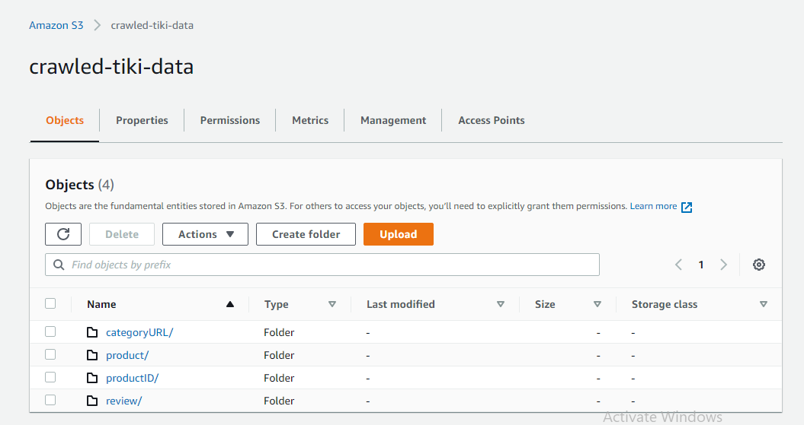
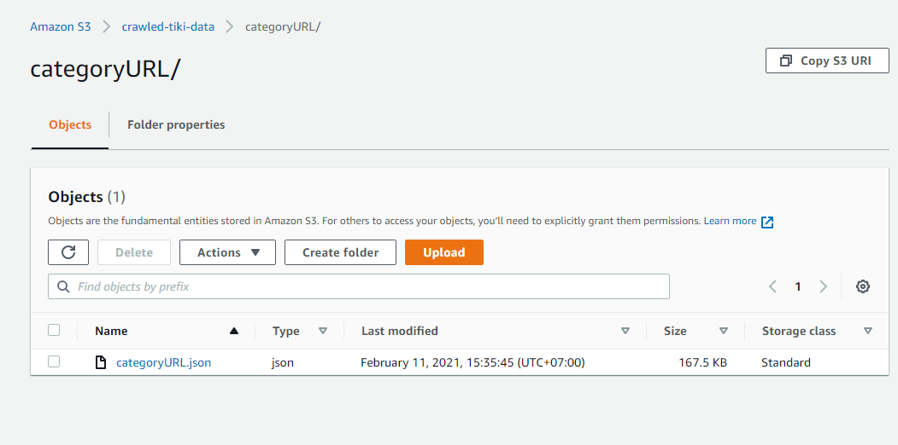
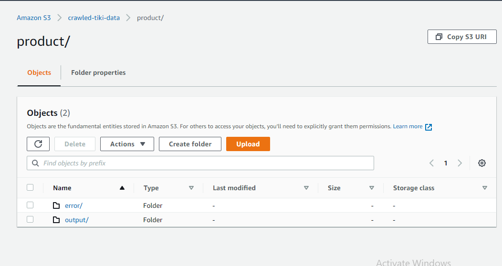
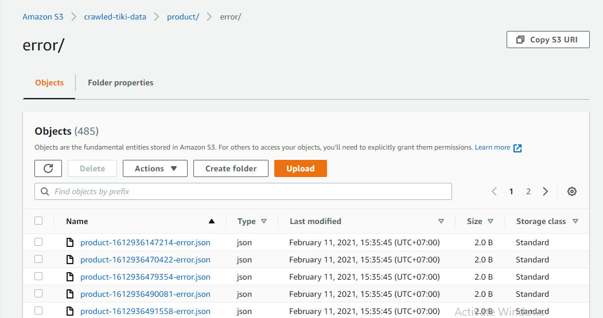
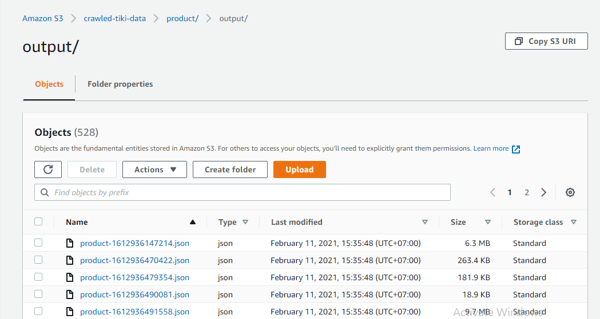
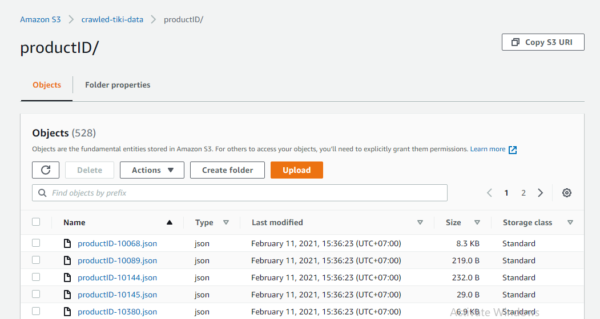
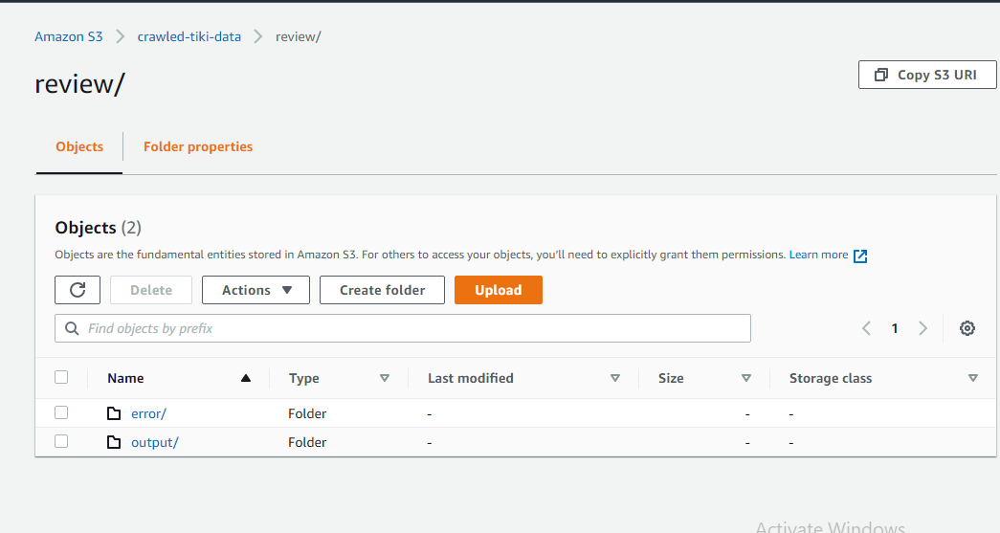
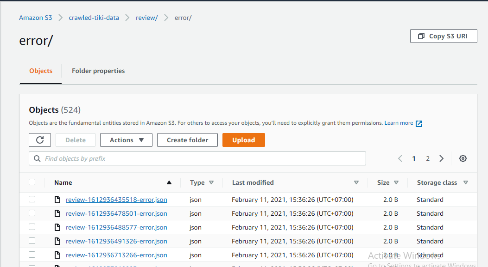
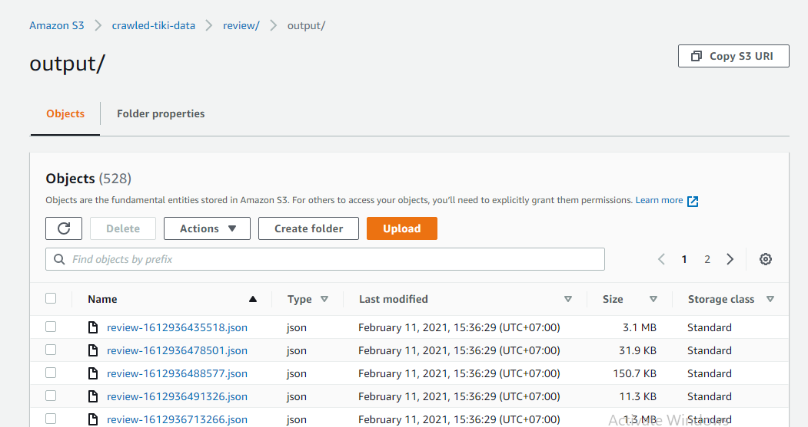

# Tiki Crawler

## Table of Contents

- [Introduction](#introduction)
- [Context](#context)
- [Structure](#structure)
- [Deployment](#deployment)
- [Result](#result)

## Introduction

This project is an enhanced version of the school project ( which requires crawling products and reviews in a single category of Tiki by using tools, hand coding).

Now it is able to crawl products and reviews all categories that can be found in Tiki main menu.

## Context

Tiki is a SPA ( Single-page application) eCommerce website, which make it more tricky to be crawled by using test automation frameworks like: [Selenium](https://www.selenium.dev/), [Cypress](https://www.cypress.io/),... or headless-browsers: [Puppeteer](https://pptr.dev/), [PhantomJS](https://phantomjs.org/),...

Fortunately, Tiki open its API for developers. That means we can crawl Tiki by using just HTTP request libraries ( [Axios](https://www.npmjs.com/package/axios) in this project).

## Structure

```
📦Tiki-Crawler
 ┣ 📂attachment
 ┣ 📂data
 ┃ ┣ 📂catogoryURL
 ┃ ┣ 📂product
 ┃ ┃ ┣ 📂error
 ┃ ┃ ┗ 📂output
 ┃ ┣ 📂productID
 ┃ ┗ 📂review
 ┃ ┃ ┣ 📂error
 ┃ ┃ ┗ 📂output
 ┣ 📂helper
 ┃ ┣ 📜chunkArray.js
 ┃ ┣ 📜fetchData.js
 ┃ ┣ 📜index.js
 ┃ ┗ 📜sleep.js
 ┣ 📂modules
 ┃ ┣ 📂crawlCategoryURL
 ┃ ┃ ┗ 📜crawlCategoryURL.js
 ┃ ┣ 📂crawlProduct
 ┃ ┃ ┗ 📜crawlProduct.js
 ┃ ┣ 📂crawlProductID
 ┃ ┃ ┗ 📜crawlProductID.js
 ┃ ┗ 📂crawlReview
 ┃ ┃ ┗ 📜crawlReview.js
 ┣ 📂tmp
 ┣ 📜.dockerignore
 ┣ 📜.gitignore
 ┣ 📜Dockerfile
 ┣ 📜main.js
 ┗ 📜package.json
```

## Deployment

It will take some time, so I run on AWS EC2 t1.micro ( free tier eligible) instance.

Steps:

- Launch AWS EC2 t1.micro instance with Unix based OS.

- Install Docker for EC2 instance.

- Build image from Dockerfile locally.

- Push image to Dockerhub.

- Pull image from Dockerhub to EC2 instance.

- Create folder to amount crawled data in Docker container.

- Run container and wait for data.

- Sync crawled data to S3 bucket.

## Result










